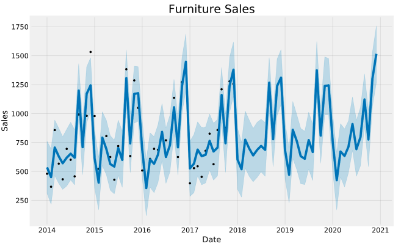

# Time Series Analaysis & Forecasting Of Superstore Data

## Capstone Project

### Abstract

Most retail companies like to estimate the upcoming sales. A superior forecasting can avoid
them from overestimating or underestimating the future sales which can prevent them
substantial losses to the companies. Using certain machine learning algorithms and techniques,
companies can possibly manage their inventory more sensibly and cut down on additional
operational expenses. In this project, we aim to execute a machine learning technique to
construct and adjust a sales forecasting model and perform estimation on sales in the future.
We also use visualisations for easier and better understanding of outcomes from the data for
the user.

### Research Problem

In a retail store, there are some products that show more seasonality than others while there
can be situations where there is a seasonality in the sales of a store all together. In this project,
using our superstore data, we want to be able to build an algorithm that can capture the
underlying seasonality of data of different category of products in order to forecast future sales
of these products and also compare their forecasts to each other.

### Purpose/Research Objectives

Following are the objectives we aim to achieve through this project:

- To check for seasonality of different category of products.
- To build a machine learning model (SARIMA) to predict sales of products using time series forecasting.
- To use FBProphet for forecasting sales of products.
- To check for accuracy of these techniques.
- To compare the sales of different category of products.

### Data Source

The data used in this analysis is secondary data which is a sample superstore data found on
Kaggle. The data is collected over a period of 4 years from 2014 to 2017.

The data used for this analysis consists of 9994 entries (rows) of products (either furniture or
office supplies) and 22 columns, out of which we will be using only 3 columns in our analysis

### Data Analysis Flow

### Analysis & Result

- On plotting the existing data, we found a distinguishable pattern in the sales of Furniture- they were low at the beginning of the year and high at the end of the year.
- There was always an upward trend within any single year with a couple of low months in the mid of the year.

- We also used time series decomposition that allows us to decompose our time series analysis into three different components: trend, seasonality and noise.
- Trend tells us the increasing or decreasing value in time series.
- Seasonality represents the repeating short-term cycle in the series.
- Noise is the random variation in the series.

- On running the model diagnostics for our SARIMA model, we find out that the model residuals are near normally distributed as shown below

- On validating our forecasts, our line plot showed that our true value and observed values aligned pretty well as shown below

- Our model was able to forecast average daily Furniture sales in the test set within 151.64 of the actual sales. This was determined by the root mean squared error of our forecast
- As we forecast further out into the future, it is natural for us to become less confident in our values.
- This is reflected by the confidence intervals generated by our model, which grow larger as we move further out into the future.

- We observed that sales of furniture and office supplies shared a similar seasonal pattern. Early of the year is the off season for both of the two categories.
- It seems summer time is quiet for office supplies too.

- Similar to Furniture sales, we used time series decomposition that allows us to decompose our time series analysis into three different components: trend, seasonality
and noise.

- On running the model diagnostics for our SARIMA model, we find out that the model residuals are near normally distributed as shown below.

- On validating our forecasts, our line plot showed that our true value and observed values aligned pretty well for later years of forecasts as shown below

- Our model was able to forecast average daily Furniture sales in the test set within 256.6 of the actual sales. This was determined by the root mean squared error of our forecast.
- The model accuracy for Office Supplies was not as good as the one for Furniture sales data.

### Comparision

- In addition, average daily sales for furniture are higher than those of office supplies in most
of the months. It is understandable, as the value of furniture should be much higher than
those of office supplies. This is observed in the figure below.
- Occasionally, office supplies passed furniture on average daily sales, like on 2014-07-01

- We have used the fbprophet library and its functions to model and visualize our forecasted Furniture sales data

- Similary, for Office Supplies’ sales data as shown below

- We then compared Furniture & Office Supplies’ sales forecasts.
- Office Supplies’ sales showed a steeper trend than Furniture sales’ forecasts.

- The sales for both furniture and office supplies have been linearly increasing over time and
will be keep growing, although office supplies’ growth seems slightly stronger.
- The best month for Furniture is December and the worst month for Furniture is April as
shown below.

- The best month for Office Supplies is October and the worst month for Office Supplies is
February as shown below

## Summary

### Major Findings

- We successfully fit an SARIMA model to our seasonal univariate sales data and
forecasted future Furniture sales with a root mean squared error of 151.64, while our
sale range varied from 400 to over 1200.
- We forecasted Office Supplies sales with a root mean squared error of 256.6.
- We also used Facebook Prophet to compare our Furniture and Office Supplies sales
and their forecasts.
- We observed a pattern in sales of both categories and there was an upward (linear) sales
trend in both of the categories. Although, the Office Supplies had a relatively steeper
trend than Furniture sales.
- While one can expect Furniture sales to be higher, there were months where Office
Supplies sales surpassed Furniture sales.
- The worst month for furniture is April, the worst month for office supplies is February.
- The best month for furniture is December, and the best month for office supplies is
October.

### Conclusions & Implications

- Time series analysis is a technique that permits us to make a better description of
variability of the data, which in turn allows to restrain uncertainty of forecasts, and
therefore provides a better estimation of present and future risk of observing values.
- In many time series data, frequent seasonal effects come into play. Using an SARIMA
model can help us capture these seasonalities and forecast better predictions.
- Doing this can help estimate demand of products, through different seasonalities, and
manage stores’ inventory more efficiently. The store can reduce inventory in low sales
month and add additional inventory on higher sales months.
- Facebook Prophet provides us with the ability to make time series predictions with good
accuracy using simple intuitive parameters and has support for including impact of
custom seasonality and holidays.

### Limitations of the Study

We haven’t added any additional intuitive parameters to improve the accuracy of our
predictions. We have used the data as it is and used monthly time scale to determine best and
worst month of sales. Additionally, our dataset includes overall sales of a product across the
US, without location being a specific factor.

### Future Scope

In the future, we can use time scales down to weekly and daily sales to improve our predictions
and use parameters such as common holidays- Christmas, Thanksgiving, New Years, etc. to
improve model accuracy. We aim to also add location as a factor to analyze which cities
perform better than other cities.

